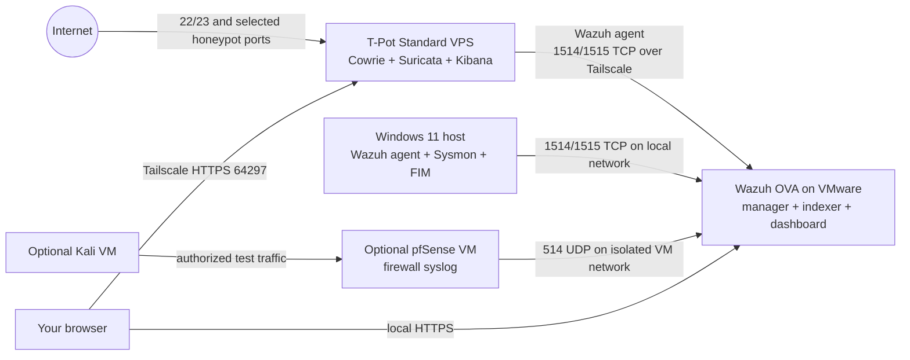

# MPrince SIEM + Honeypot Lab

An end-to-end, reproducible SOC lab: Wazuh on one local VM, Windows endpoint telemetry, an optional isolated pfSense/Kali network, and an internet-facing T-Pot VPS. T-Pot's Cowrie and Suricata events flow into the local Wazuh dashboard through a private Tailscale connection.

**Status:** Deployment guide and example configuration. The lab is complete only after you run the acceptance tests and replace the evidence placeholders with your own results. Nothing in this repository claims that a VPS or SIEM has already been deployed.

## What you will build

**Data direction:** T-Pot generates events; a Wazuh agent on the VPS reads the JSON files and initiates an encrypted connection to the manager. The Wazuh manager is never exposed to the public internet. T-Pot's native Kibana remains available for comparison. Its *Sensor* mode expects a T-Pot Hive and is not used here; the VPS runs **Standard / Hive** as a standalone installation.

## Resource and account checklist

| Component | Baseline | Location |
| --- | --- | --- |
| Wazuh OVA | 4 vCPU, 8 GB RAM, 50 GB disk | VMware on Windows |
| Windows agent + Sysmon | Existing Windows 11 host | Windows host |
| T-Pot Standard / Hive | Plan for at least 16 GB RAM, 256 GB SSD, public IPv4 | Dedicated VPS |
| Kali | 2 vCPU, 2–4 GB RAM | Optional VMware VM |
| pfSense | 1–2 vCPU, 2 GB RAM | Optional VMware VM |
| Accounts | VPS provider, Tailscale, optional VirusTotal | External services |

The VPS must permit the selected honeypot ports and have a supported **minimal** Linux image. T-Pot's supported distribution list changes; at the time this guide was written it listed Debian 13 and Ubuntu 26.04. Check [T-Pot's current requirements](https://github.com/telekom-security/tpotce#system-requirements) *before* ordering a VPS. Standard / Hive is larger than the 8 GB/128 GB T-Pot Sensor because it also hosts the Elastic stack and dashboard.

## A-to-Z route

Follow in order. Each chapter ends with a checkpoint; do not proceed past a failed checkpoint.

1. [Plan names, addresses, isolation, and evidence](docs/01-plan.md)
2. [Import and secure the local Wazuh OVA](docs/02-wazuh.md)
3. [Enroll Windows, Sysmon, and file integrity monitoring](docs/03-windows.md)
4. [Build the T-Pot VPS and verify its native dashboard](docs/04-tpot.md)
5. [Connect T-Pot to Wazuh over Tailscale](docs/05-ingestion.md)
6. [Install detection rules and run end-to-end tests](docs/06-detection-and-validation.md)
7. [Add pfSense, VirusTotal, and dashboards](docs/07-extensions.md)
8. [Operate the lab and publish the portfolio case study](docs/08-operations-and-portfolio.md)

Track progress in [CHECKLIST.md](CHECKLIST.md). Keep your real values in a private copy of [inventory.example.md](inventory.example.md), never in this public repository.

## Success criteria

- Wazuh dashboard shows the Windows host and T-Pot VPS as active agents.
- A benign Windows test creates a Sysmon or FIM alert.
- A test SSH login against **your own** T-Pot public IP appears in T-Pot Kibana and in Wazuh under the T-Pot agent.
- A Suricata alert from T-Pot is visible in Wazuh when one is generated.
- Optional pfSense firewall events and VirusTotal enrichment are demonstrated separately.
- The portfolio post includes a diagram, versions, test method, alert evidence, one original rule or tuning decision, limitations, and a link to this repository.

## Scope and handling of captured data

The T-Pot VPS is deliberately exposed. Keep it separate from your home network and personal accounts. Do not put real credentials or sensitive files on it. Restrict management ports at the VPS provider firewall and through the tailnet. Do not enable a subnet router or exit node on the VPS. T-Pot currently enables community data submission by default; decide whether to keep it before exposure and see [the upstream opt-out instructions](https://github.com/telekom-security/tpotce#community-data-submission).

Captured passwords, session transcripts, downloaded files, PCAPs, public IPs, API keys, Tailscale auth material, and raw VM configs stay out of Git. Publish only sanitized examples. `.gitignore` covers common local artifacts, but review every staged file before pushing.

## Sources and version policy

The commands and paths here are based on the upstream [Wazuh OVA](https://documentation.wazuh.com/current/deployment-options/virtual-machine/virtual-machine.html), [Wazuh agent](https://documentation.wazuh.com/current/installation-guide/wazuh-agent/wazuh-agent-package-linux.html), [Wazuh log collection](https://documentation.wazuh.com/current/user-manual/capabilities/log-data-collection/monitoring-log-files.html), [T-Pot](https://github.com/telekom-security/tpotce), [Tailscale Linux install](https://tailscale.com/docs/install/linux), and [pfSense remote logging](https://docs.netgate.com/pfsense/en/latest/monitoring/logs/remote.html) documentation checked 2026-09-23. The Wazuh OVA documented then was 4.14.7. Before deployment, verify the current upstream version, record the exact versions in your private inventory, and compare changed installer prompts or file paths with this guide.

This guide is original work informed by the linked upstream documentation and the example labs by [UsmanPrime](https://github.com/UsmanPrime/Wazuh-Setup) and [marxgoo](https://github.com/marxgoo/Wazuh-SOC-Lab). It does not redistribute their screenshots or PDFs.
